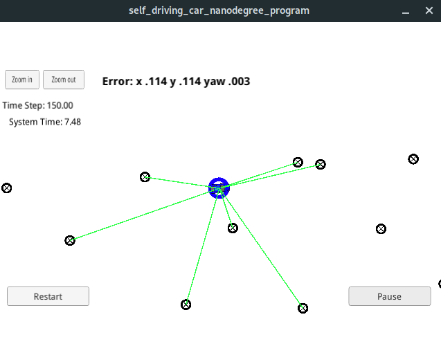

# CarND-Kidnapped-Vehicle-P3
Udacity Self-Driving Car Nanodegree - Kidnapped Vehicle project

# Overview

This project ha the Particle Filter implementation applied to a Kidnapped robot problem.

A Udacity simulator is provided by Udacity ([it could be downloaded here](https://github.com/udacity/self-driving-car-sim/releases))..

See the udacity project to start from on this project ([here](https://github.com/udacity/CarND-Kidnapped-Vehicle-Project)).

# Prerequisites

The project has the following dependencies (from Udacity's seed project):

- cmake >= 3.5
- make >= 4.1
- gcc/g++ >= 5.4
- [uWebSockets](https://github.com/uNetworking/uWebSockets)
- [Udacity's simulator](https://github.com/udacity/self-driving-car-sim/releases).

In order to install the necessary libraries, use the [install-arch-linux.sh](./install-arch-linux.sh).

## Running the Code

This repository includes two files that can be used to set up and install uWebSocketIO for either Linux or Mac systems. For windows you can use either Docker, VMware, or even Windows 10 Bash on Ubuntu to install uWebSocketIO.

Once the install for uWebSocketIO is complete, the main program can be built and ran by doing the following from the project top directory.

1. mkdir build
2. cd build
3. cmake ..
4. make
5. ./particle_filter

Alternatively some scripts have been included to streamline this process, these can be leveraged by executing the following in the top directory of the project:

1. ./clean.sh
2. ./build.sh
3. ./run.sh

Tips for setting up your environment can be found [here](https://classroom.udacity.com/nanodegrees/nd013/parts/40f38239-66b6-46ec-ae68-03afd8a601c8/modules/0949fca6-b379-42af-a919-ee50aa304e6a/lessons/f758c44c-5e40-4e01-93b5-1a82aa4e044f/concepts/23d376c7-0195-4276-bdf0-e02f1f3c665d)


You will see a message indicating the filter is listening:

```
> ./run.sh
Listening to port 4567

```

Open the simulator 




Whe you click on "Start" button, the vehicle starts moving and the magic to.

# Code description

The Particle Filter is implemented in [src/particle_filter.cpp](./src/particle_filter.cpp):

- Initialization: Particle initialization is implemented at [ParticleFilter::init](./src/particle_filter.cpp#L24) from line 24 to line 57.

- Prediction: The prediction step is implemented at [ParticleFilter::prediction](./src/particle_filter.cpp#L64) from line 59 to line 91.

- Weight's update: It is implemented at [ParticleFilter::updateWeights](./src/particle_filter.cpp#L64) from line 126 to line 198.

Almost the rest of the code happens on [src/main.cpp](./src/main.cpp). 
